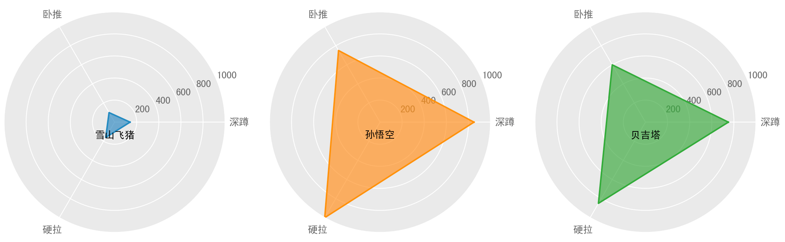

# 生成战力分布图

### 示例代码一：漫威超级英雄
```python
from tool import generate_ability_map

abilities = ['智力', '力量', '速度', '耐力', '能量', '技能']
super_heros = {
    '美国队长': [5, 4, 3, 4, 3, 7],
    '钢铁侠': [6, 3, 5, 5, 3, 3],
    '绿巨人': [6, 7, 3, 7, 1, 5],
    '蜘蛛侠': [5, 4, 5, 4, 2, 5],
    '灭霸': [7, 7, 7, 7, 7, 7],
    '雷神': [2, 5, 6, 7, 6, 6],
    '绯红女巫': [3, 3, 3, 3, 7, 3],
    '黑寡妇': [5, 3, 2, 3, 3, 7],
    '鹰眼': [5, 3, 3, 2, 2, 7],
}
generate_ability_map(abilities, super_heros)
```
运行结果


## 示例代码二：火影
```python
abilities = ['忍', '体', '幻', '贤', '力', '速', '精', '印']
super_heros= {
    '旗木卡卡西': [10, 9, 8, 10, 7, 9, 6, 10],
    '自来也': [10, 9, 6, 9, 9, 9, 10, 9],
    '纲手': [10, 10, 7, 10, 10, 7, 8, 8],
    '宇智波鼬': [10, 9, 10, 10, 7, 10, 5, 10],
}
generate_ability_map(abilities,super_heros, 2)
```
运行结果


## 示例代码二：健身
```python
super_heros = {
    '雪山飞猪': [140,100,160],
    '孙悟空': [800,550,1000],
    '贝吉塔': [750,500,950],
}
generate_ability_map(abilities,super_heros)
```
运行结果



代码详细说明，请查看博客：[Matplotlib绘制漫威英雄战力图，带你飞起来！](https://www.cnblogs.com/chenqionghe/p/12376528.html)